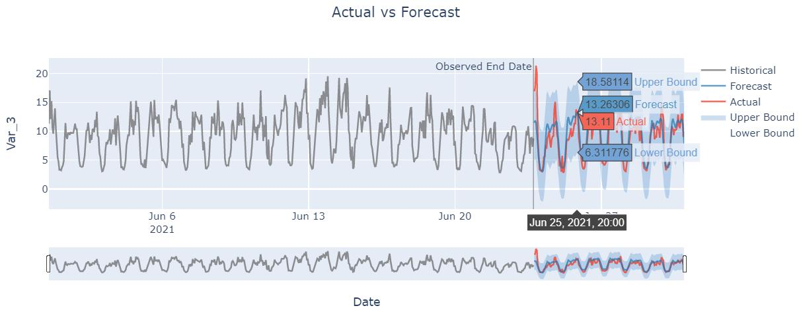
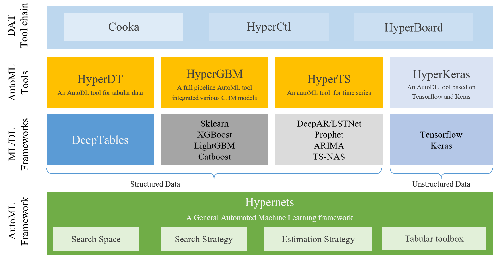

<h1 align="center">

</h1><br>

<h4 align="center">Statistics | Deep Learning | Neural Architecture Search</h4>

<div align="center">

[简体中文](README_zh_CN.md) • [Installation](https://hyperts.readthedocs.io/en/latest/contents/0200_installation.html) • [Documentation](https://hyperts.readthedocs.io/en/latest/) • [Examples](https://github.com/DataCanvasIO/HyperTS/tree/main/examples) 

[](https://pypi.org/project/hyperts)
[](https://pypi.python.org/pypi/hyperts)
[](https://anaconda.org/conda-forge/HyperTS)
[](https://pypi.org/project/hyperts)
[](https://github.com/DataCanvasIO/hyperts/blob/master/LICENSE)
</div>

:dizzy: Easy-to-use, powerful, and unified full pipeline automated time series toolkit. Supports forecasting, classification, regression, and anomaly detection.


## We Are Hiring！
Dear folks, we are offering challenging opportunities located in Beijing for both professionals and students who are keen on AutoML/NAS. Come be a part of DataCanvas! Please send your CV to yangjian@zetyun.com. (Application deadline: TBD.) 


## Overview
HyperTS is a Python package that provides an end-to-end time series (TS) analysis toolkit. It covers complete and flexible AutoML workflows for TS, including data clearning, preprocessing, feature engineering, model selection, hyperparamter optimization, result evaluation, and visualization.

Multi-mode drive, light-heavy combination is the highlighted features of HyperTS. Therefore, statistical models (STATS), deep learning (DL), and neural architecture search (NAS) can be switched arbitrarily to get a powerful TS estimator.

As an easy-to-use and lower-threshold API, users can get a model after simply running the experiment, and then execute ```.predict()```, ```.predict_proba()```, ```.evalute()```, ```.plot()``` for various time series analysis.

## Installation

Note:

- Prophet is required by HyperTS, install it from ``conda`` before installing HyperTS using ``pip``.
- Tensorflow is an optional dependency for HyperTS, install it if using DL and NAS mode.

HyperTS is available on Pypi and can be installed with ``pip``:

```bash
pip install hyperts
```

You can also install HyperTS from ``conda`` via the ``conda-forge`` channel:

```bash
conda install -c conda-forge hyperts
```

If you would like the most up-to-date version, you can instead install direclty from ``github``:

```bash
git clone https://github.com/DataCanvasIO/HyperTS.git
cd HyperTS
pip install -e . 
pip install tensorflow #optional
````

For more installation tips, see [installation](https://hyperts.readthedocs.io/en/latest/contents/0200_installation.html).

## Tutorial

|[English Docs](https://hyperts.readthedocs.io/en/latest/) / [Chinese Docs](https://hyperts.readthedocs.io/zh_CN/latest)| Discription |
| --------------------------------- | --------------------------------- |
[Expected Data Format](https://hyperts.readthedocs.io/en/latest/contents/0300_dataformat.html)|What data formats do HyperTS expect?|
|[Quick Start](https://hyperts.readthedocs.io/en/latest/contents/0400_quick_start.html)| How to get started quickly with HyperTS?|
|[Advanced Ladder](https://hyperts.readthedocs.io/en/latest/contents/0500_advanced_config.html)|How to realize the potential of HyperTS?|
|[Custom Functions](https://hyperts.readthedocs.io/en/latest/contents/0600_custom_functions.html)|How to customize the functions of HyperTS?|

## Examples

Time Series Forecasting

Users can quickly create and ```run()``` an experiment with ```make_experiment()```, where ```train_data```, and ```task``` are required input parameters. In the following forecast example, we define the experiment as a multivariate-forecast ```task```, and use the statistical model (stat ```mode```) . Besides, the mandatory arguments ```timestamp``` and ```covariates``` (if have) should also be defined in the experiment.

```python
from hyperts import make_experiment
from hyperts.datasets import load_network_traffic

from sklearn.model_selection import train_test_split

data = load_network_traffic()
train_data, test_data = train_test_split(data, test_size=0.2, shuffle=False)

model = make_experiment(train_data.copy(),
                        task='multivariate-forecast',
                        mode='stats',
                        timestamp='TimeStamp',
                        covariates=['HourSin', 'WeekCos', 'CBWD']).run()

X_test, y_test = model.split_X_y(test_data.copy())

y_pred = model.predict(X_test)

scores = model.evaluate(y_test, y_pred)

model.plot(forecast=y_pred, actual=test_data)
```



<details>
  <summary>Time Series Classification (click to expand)</summary>

```python
from hyperts import make_experiment
from hyperts.datasets import load_basic_motions

from sklearn.metrics import f1_score
from sklearn.model_selection import train_test_split

data = load_basic_motions()
train_data, test_data = train_test_split(data, test_size=0.2)

model = make_experiment(train_data.copy(),
                        task='classification',
                        mode='dl',
                        tf_gpu_usage_strategy=1,
                        reward_metric='accuracy',
                        max_trials=30,
                        early_stopping_rounds=10).run()

X_test, y_test = model.split_X_y(test_data.copy())

y_pred = model.predict(X_test)
y_proba = model.predict_proba(X_test)

scores = model.evaluate(y_test, y_pred, y_proba=y_proba, metrics=['accuracy', 'auc', f1_score])

print(scores)
  ```
</details>

<details>
  <summary>Time Series Anomaly Detection (click to expand)</summary>

```python
from hyperts import make_experiment
from hyperts.datasets import load_real_known_cause_dataset

from sklearn.model_selection import train_test_split

data = load_real_known_cause_dataset()
ground_truth = data.pop('anomaly')

detection_length = 15000
train_data, test_data = train_test_split(data, test_size=detection_length, shuffle=False)

model = make_experiment(train_data.copy(),
                        task='detection',
                        mode='stats',
                        reward_metric='f1',
                        max_trials=30,
                        early_stopping_rounds=10).run()

X_test, _ = model.split_X_y(test_data.copy())
y_test = ground_truth.iloc[-detection_length:]

y_pred = model.predict(X_test)
y_proba = model.predict_proba(X_test)

scores = model.evaluate(y_test, y_pred, y_proba=y_proba)

model.plot(y_pred, actual=test_data, history=train_data, interactive=False)
  ```
</details>

<details>
  <summary>Time Series MetaFeatures Extract (click to expand)</summary>

```python
from hyperts.toolbox import metafeatures_from_timeseries
from hyperts.datasets import load_random_univariate_forecast_dataset

data = load_random_univariate_forecast_dataset()

metafeatures = metafeatures_from_timeseries(x=data, timestamp='ds', scale_ts=True)
```
</details>

**More detailed guides:** [EXAMPLES.](https://github.com/DataCanvasIO/HyperTS/tree/main/examples)

## Key Features

HyperTS supports the following features:

**Multi-task Support:** Time series forecasting, classification, regression, and anomaly detection.

**Multi-mode Support:** A large collection of TS models, including statistical models (Prophet, ARIMA, VAR, iForest, etc.), deep learning models(DeepAR, GRU, LSTNet, NBeats, VAE, etc.), and neural architecture search.

**Multi-variate Support:** From univariate to multivariate time series.

**Covariates Support:** Deep learning models support covariates as input featues for time series forecasting. 

**Probabilistic Intervals Support:** Time series forecasting visualization can show confidence intervals.

**Diversified Preprocessing:** Outlier clipping, missing value imputing, sequence smoothing, normalization, etc. 

**Abundant Metrics:** A variety of performance metrics to evaluate results and guide models optimization, including MSE, SMAPE, Accuracy, F1-Score,etc. 

**Powerful Search Strategies:** Adapting Grid Search, Monte Carlo Tree Search, Evolution Algorithm combined with a meta-learner to enable a powerful and effective TS pipeline.

**Ensemble:** Refinement greedy emsemble glues the most powerful models.

**Cross Validation:** Multiple time series cross-validation strategies ensure generalization ability.

## Communication
- If you wish to contribute to this project, please refer to [CONTRIBUTING](CONTRIBUTING.md).
- If you have any question or idea, you can alse participate with our [Discussions Community](https://github.com/DataCanvasIO/HyperTS/discussions).

## HyperTS Related Projects
* [Hypernets](https://github.com/DataCanvasIO/Hypernets): A general automated machine learning (AutoML) framework.
* [HyperGBM](https://github.com/DataCanvasIO/HyperGBM): A full pipeline AutoML tool integrated various GBM models.
* [HyperDT/DeepTables](https://github.com/DataCanvasIO/DeepTables): An AutoDL tool for tabular data.
* [HyperKeras](https://github.com/DataCanvasIO/HyperKeras): An AutoDL tool for Neural Architecture Search and Hyperparameter Optimization on Tensorflow and Keras.
* [HyperBoard](https://github.com/DataCanvasIO/HyperBoard): A visualization tool for Hypernets.
* [Cooka](https://github.com/DataCanvasIO/Cooka): Lightweight interactive AutoML system.



## DataCanvas


HyperTS is an open source project created by [DataCanvas](https://www.datacanvas.com/). 
